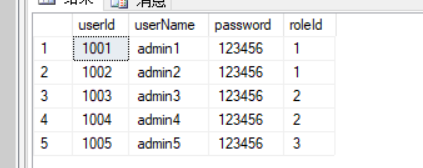
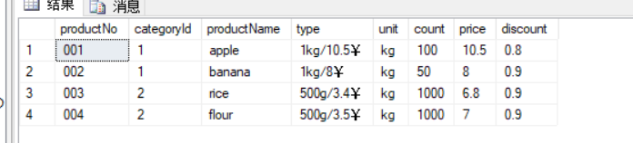

# 数据库实习文档
## 一.实体类
### 1.users

```java
	private int userId;//管理员编号
    private String userName;//管理员姓名
    private String password;//管理员密码
    private int roleId;//管理员级别
```
管理员级别:

*  0 -> 主管理员

*  1 -> 商品管理员

*  2 -> 收银员

### 2.products



```java
private String productNo;//商品编号
private String categoryId;//种类编号
private String productName;//商品名
private String type;//规格
private String unit;//单位
private int count=-1;//库存数量
private double price;//单价
private double discount;//折扣
```

categoryId: 

* 1.水果
* 2.主食
* 3.蔬菜

type：销售规格 (eg:1kg/10.5￥)

### 3.customers


```java
private String customerNo;//会员编号
private String customerName;//会员姓名
private String phone;//会员电话
private int score;//会员积分
```

